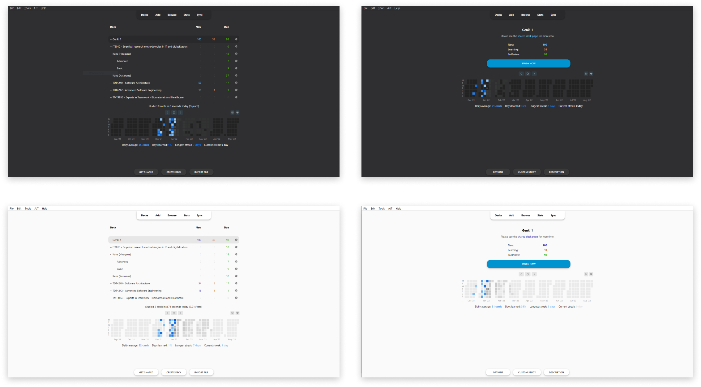
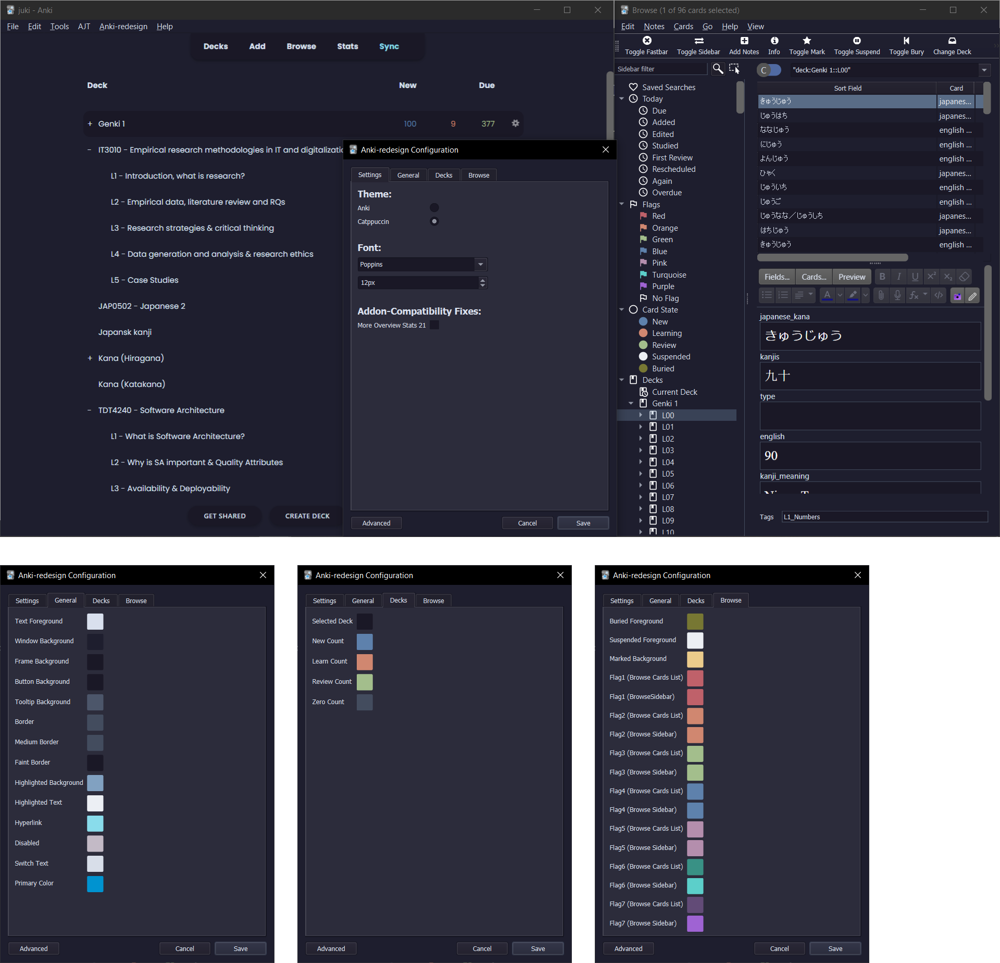

# Anki-redesign

> A new lightweight look for Anki compatible with most (if not all) versions of Anki 2.1.X running QT5 and QT6. - Specifically tested on Anki 2.1.49

Note: This add-on uses hooks and doesn't overwrite the original Anki code views that much, meaning that most add-ons should properly work with Anki-redesign enabled. However, if there is any add-on found to not be working properly, feel free to make an [issue](https://github.com/Shirajuki/anki-redesign/issues) and I'll try to add support for it!
(List of tested addons and manual fixes for them to work can be seen on the [project github wiki](https://github.com/Shirajuki/anki-redesign/wiki/Compatible-Add-ons-for-Anki-2.1).)

Note2: <b>This addon also works as a theming addon</b> as it enables the possibility of user customization on almost all Anki views/windows through the injection of CSS and QT CSS on the different components. The adding of custom styling can be done by copying over the css files from `./files` to `./user_files` and then editing the styling there. Primary color of button focus, link color, as well as the font, can be changed in the addon config.

Note3: If the addon is not updating try open anki while holding shift to turn off all addons, then update and restart. :)

**Manually tested on the following Anki versions:**

- 2.1.56
- 2.1.54
- 2.1.50
- 2.1.49
- 2.1.26
- 2.1.22

**(Planned) Updates / todos (as of 01.01.2023):**

- [ ] Recheck "Advanced Review Button" add-on compatibility
- [ ] Recheck "Full screen" add-on compatibility
- [ ] Re-add windows dark titlebar
- [ ] Add a public theme sharing site where users can upload their themes and possibly have them preinstalled alongside the add-on
- [ ] Add styling support and fix themes for Anki 2.1.57

 

 

**Guide:**

1. Download the Add-on from [AnkiWeb](https://ankiweb.net/shared/info/308574457)
2. there will be an Anki-redesign menu at the top. Click the config submenu to open the Anki-redesign Configuration dialog.
3. Customize Anki as you like, see the [readme image](https://raw.githubusercontent.com/Shirajuki/anki-redesign/main/screenshots/guide.png)
4. The colors will update after clicking "Save", however to make sure everything is updated, do a restart after customizing.

**Credits:**

The concept of this add-on was inspired by the following add-on and designs:

- [Developer Nick's Redesign Add-on](https://github.com/nickdvlpr/Redesign)
- [Yanyi Yoong's Anki Reimagine](https://www.behance.net/gallery/50253077/Anki-Reimagine)
- [Beatify Anki Add-on](https://github.com/ShoroukAziz/Beautify-Anki)
- [miere43's dark titlebar Anki Add-on](https://github.com/miere43/anki-dark-titlebar)
- [AnKingMed's AnkiRecolor Add-on](https://github.com/AnKingMed/AnkiRecolor)

**Changelog:**

- 01-01-2023: Anki 2.1.56 is now compatible, some themes are however still not correctly styled as it should (v0.1.8)
- 28-10-2022: Adds language translation, fix for Contanki, and some more Catpuccin themes (v0.1.7)
- 10-10-2022: Adds fix for NDFS compatibility fix and community translation support (v0.1.6)
- 22-08-2022: Adds refactored theming engine, adding sync, clone and delete of themes more easily, along with some bugfixes. Anki-redesign preferences is also moved to the Tools menubar (v0.1.5)
- 26-07-2022: Automatic dark/light mode switch on themes is now correctly implemented, hopefully Mac toolbar bug is also fixed (v0.1.4)
- 03-07-2022: Anki 2.1.54 is now compatible, also added addon compatibility for ARBb alongside auto dark/light mode switch on themes (v0.1.3)
- 18-04-2022: Anki 2.1.50 is now compatible, also added some minor visual fixes for legacy versions (v0.1.2)
- 14-04-2022: Adds minor bugfix for showInfo function (v0.1.1)
- 13-04-2022: Adds major update adding dialog configuration and QT theming as well as some bugfixes and code cleanup (v0.1.0)
- 31-01-2022: Adds minor bugfixes and some code cleanup (v0.0.8)
- 30-01-2022: Adds customized font support, dark titlebar for windows on dark mode, more minor styling fixes (v0.0.7)
- 25-01-2022: Adds typo and error bugfixes, code cleanup update (v0.0.6)
- 24-01-2022: Adds full user customization styling through the folder user_files. User theming is now possible! (v0.0.5)
- 21-01-2022: Adds a very small update, removes unfinished styling on AddCard window (v0.0.4)
- 20-01-2022: Adds styling edits, timer and styling bugfixes, add-on now compatible with legacy versions (v0.0.3)
- 14-01-2022: Adds second update, more styling fixes (v0.0.2)
- 07-01-2022: Styling on Overview and DeckBrowser update (v0.0.1)
- 04-01-2022: Initial Release
