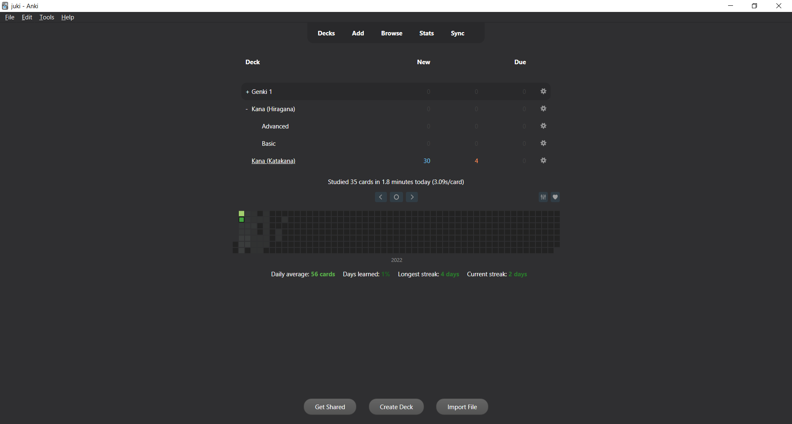
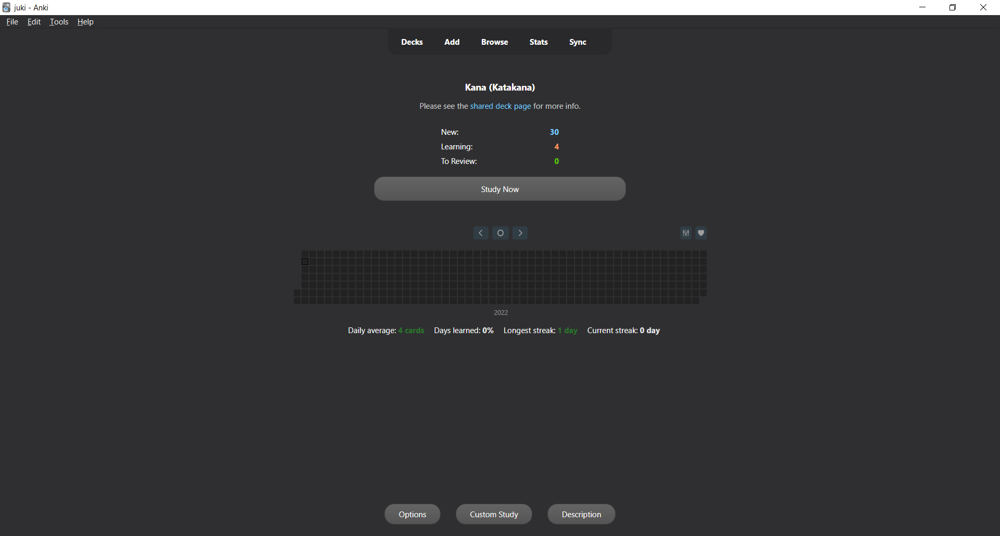

# Anki-redesign

> A new lightweight look for Anki compatible with most (if not all) versions of Anki 2.1.X running QT5. - Specifically tested on Anki 2.1.49

Note: This add-on doesn't overwrite the original Anki code views that much, meaning that most add-ons should properly work with Anki-redesign enabled. However, if there is any add-on found to not be working properly, feel free to make an [issue](https://github.com/Shirajuki/anki-redesign/issues) and I'll try to add support for it!
(List of tested addons and manual fixes for them to work can be seen on the [project github wiki](https://github.com/Shirajuki/anki-redesign/wiki/Compatible-Add-ons-for-Anki-2.1).)

Planned updates / todos (since 09.01.2022):
- Minor design fixes for a cleaner design
- Fix light-mode design and better contrasts
- Adds a primary color of choice and more lightweight user defined customizations through config file
- Manually test for backwards compatibility for older Anki versions

 

 

 

### Credits

The concept of this add-on was inspired by the following add-on and design:

- [Developer Nick's Redesign Add-on](https://github.com/nickdvlpr/Redesign)
- [Yanyi Yoong's Anki Reimagine](https://www.behance.net/gallery/50253077/Anki-Reimagine)
- [Beatify Anki Add-on](https://github.com/ShoroukAziz/Beautify-Anki)
